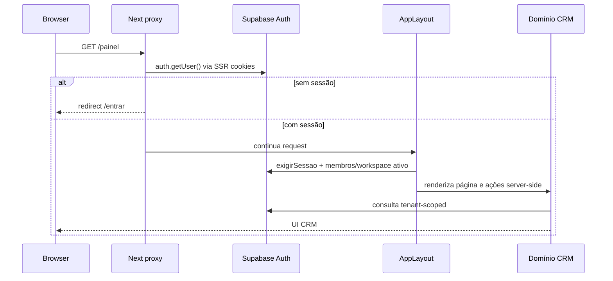
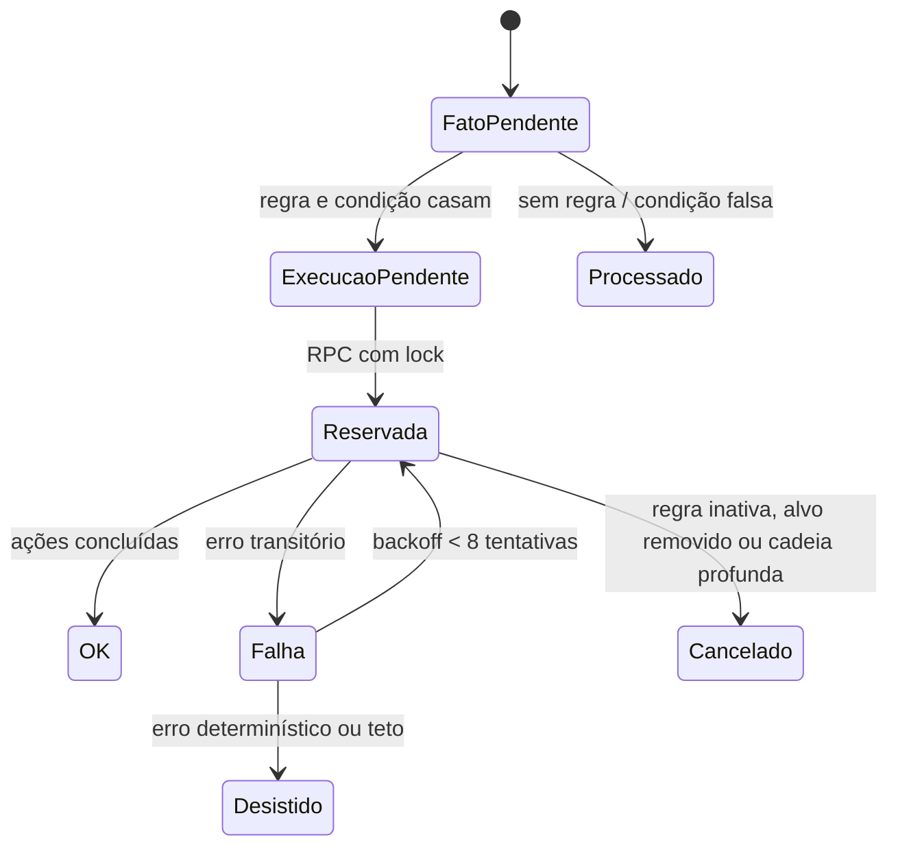
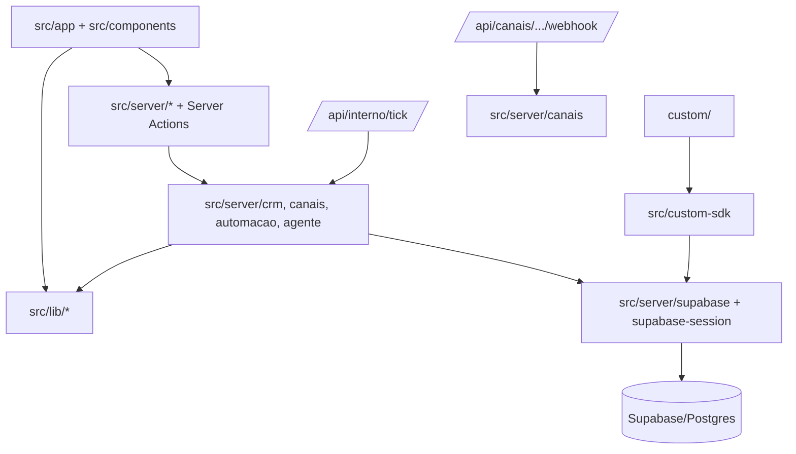

# Arquitetura do Awave CRM

> Análise gerada a partir do checkout local em `main`, commit `e43fe5d`
> (`backup antes da atualizacao de dependencias`). Não há remoto configurado
> visível neste checkout. O arquivo está em `custom/` para respeitar a regra de
> preservação da zona do comprador.

## 1. Resumo executivo

O Awave CRM é um **monólito modular full-stack** baseado em Next.js, React e
TypeScript, empacotado como uma única imagem Docker standalone. A interface usa
App Router e Server Components/Actions; o backend é composto por Route Handlers,
módulos server-only e jobs acionados por um endpoint interno de heartbeat. O
Supabase fornece autenticação, Postgres, RLS, Realtime e Storage. A unidade de
isolamento é `workspace_id`, aplicada simultaneamente no banco e nas consultas
server-side. As integrações de canais (WhatsApp/Instagram/UAzAPI/simulador),
automação, assistente de IA, egress de webhook e extensões do comprador são
processadas por filas persistidas no banco e drenadas dentro de um orçamento
compartilhado por tick.

O desenho privilegia **deploy simples e operação self-hosted** sobre separação
de serviços: um container e um banco externo. Isso reduz a superfície
operacional, mas concentra falhas, latência e escalabilidade no processo Next.js
e no endpoint de heartbeat. Os limites de segurança mais importantes são
explícitos: sessão no navegador para telas, chave service-role para workers,
RLS para leitura multi-tenant e filtros explícitos por workspace em caminhos sem
sessão.

## 2. Identidade, stack e comandos

### 2.1 Stack detectada

| Camada | Tecnologia | Evidência |
|---|---|---|
| Runtime | Node.js 22 em Debian Bookworm slim | `Dockerfile:4`, `Dockerfile:11`, `Dockerfile:46` |
| Linguagem | TypeScript strict, ES2022, módulos ESNext | `tsconfig.json:2-18` |
| Web | Next.js `~16.2.12`, App Router, output standalone | `package.json:9-10,31-35`; `next.config.ts:3-5` |
| UI | React `^19.2.7`, CSS Modules, Lucide | `package.json:31-44`; `src/components/` |
| Banco/Auth | Supabase JS/SSR sobre Postgres | `package.json:31-44`; `src/server/supabase.ts:1-9`; `src/proxy.ts:1-3` |
| Validação | Zod | `package.json:31-44`; usos em `src/` |
| IA | Mastra + `@ai-sdk/openai` | `package.json:31-44`; `src/server/agente/` |
| Filas | Tabelas Postgres + RPCs de claim/lock | `supabase/migrations/0007_webhook_egress.sql`, `0032_zona_eventos.sql`; `src/server/automacao/executor.ts:46-48` |
| Testes | Vitest em Node | `package.json:11`; `vitest.config.ts:1-12` |
| Drag and drop | `@dnd-kit/core` e `@dnd-kit/sortable` | `package.json:31-44`; `src/app/(app)/negocios/` |
| Deploy | Docker multi-stage, Next standalone, usuário não-root | `Dockerfile:3-6`, `Dockerfile:11-17`, `Dockerfile:46-74` |

### 2.2 Comandos e verificação

| Comando | Propósito | Evidência / estado |
|---|---|---|
| `pnpm dev` | Servidor de desenvolvimento | `package.json:8` |
| `pnpm build` | Build de produção Next.js | `package.json:9`; também exigido em `AGENTS.md:126-127` |
| `pnpm start` | Executa o build standalone/produção | `package.json:10` |
| `pnpm test` | Executa Vitest uma vez | `package.json:11`; `vitest.config.ts:5` |
| `pnpm exec tsc -p custom --noEmit` | Type-check da zona do comprador | `custom/LEIA-ME.md:49-55` |
| `pnpm verify:foundation` | Verifica sincronização da foundation | `package.json:13`; script presente |
| `pnpm verify:no-inlining` | Verifica ausência de inlining indevido | `package.json:14`; script presente |
| `pnpm sync:foundation` | Sincroniza foundation | `package.json:12`; `[UNVERIFIED]` script ausente no checkout |
| `pnpm check:motor` | Confere motor intocado | `package.json:15`; `[UNVERIFIED]` script ausente no checkout |
| `pnpm gen:manifest` | Gera manifesto | `package.json:16`; `[UNVERIFIED]` script ausente no checkout |
| `pnpm audit:entrega` | Audita arquivos entregues | `package.json:17`; `[UNVERIFIED]` script ausente no checkout |
| `pnpm lint` | Lint | `[UNVERIFIED]` não há script `lint` nem configuração de lint detectada |
| `pnpm format` | Formatação | `[UNVERIFIED]` não há script/configuração de formatter detectada |
| Testes unitários | `tests/**/*.spec.ts` | `[UNVERIFIED]` nenhum teste encontrado; `passWithNoTests: true` permite sucesso sem testes (`vitest.config.ts:5`) |
| CI obrigatório | Workflow/status check | `[UNVERIFIED]` não há `.github/` no checkout; enforcement de branch protection exige confirmação administrativa |

O `pnpm-lock.yaml` está modificado no worktree antes desta análise. A análise não
altera nem reverte essa mudança.

## 3. Entradas e topologia

### 3.1 Entradas HTTP

- **Páginas públicas:** `/entrar`, `/cadastrar`, `/convite/[token]`,
  `/diagnostico`, `/licenca`, `/sem-workspace`.
- **Aplicação autenticada:** grupo `src/app/(app)/`, contendo painel, CRM,
  contatos, empresas, negócios, agenda, conversas, automações, base de
  conhecimento, agentes, relatórios e configuração.
- **Extensões de telas:** `/x/[...slug]`, carregadas a partir de
  `custom/paginas/`.
- **Health:** `/api/health` e `/api/v1/health`.
- **API de integração:** `/api/v1/*`; o `echo` existe para testar credenciais
  mesmo em estados de licença bloqueada, conforme `AGENTS.md`.
- **Ingressos de canais:** `/api/canais/[provider]/webhook/[[...caminho]]`.
- **Heartbeat:** `POST /api/interno/tick`, protegido por `TICK_SECRET`.
- **Extensões HTTP:** `/api/custom/[...slug]`, implementado pela zona
  `custom/api/`.

O proxy intercepta a aplicação inteira, preserva as rotas públicas, deixa APIs
passarem para sua própria autenticação e libera explicitamente o webhook de
canal sem sessão (`src/proxy.ts:15-32`, `src/proxy.ts:35-52`). Para páginas
não públicas, ele valida o usuário via Supabase SSR e redireciona para `/entrar`
quando não há sessão (`src/proxy.ts:60-99`).

### 3.2 Organização do código

| Diretório | Papel arquitetural |
|---|---|
| `src/app/` | Rotas Next.js, páginas, Route Handlers e composição de UI |
| `src/app/(app)/_crm/` | Componentes compartilhados das telas CRM |
| `src/components/` | Shell, componentes visuais e carregamento de slots |
| `src/server/auth/` | Sessão, workspace ativo, convites e bootstrap |
| `src/server/crm/` | Acesso de domínio para contatos, negócios, funis, atividades, relatórios |
| `src/server/automacao/` | Planejamento e execução de automações |
| `src/server/canais/` | Providers, ingestão, dispatch, envio, mídia e perfis |
| `src/server/agente/` | Fila, contexto, rodadas, custos, tetos e resposta do assistente |
| `src/server/license/` | Estado, cache, batida e bloqueio de licença |
| `src/server/atualizacao/` | Detecção, aplicação, Git, rollback e avisos de atualização |
| `src/server/custom/` | Runtime das extensões do comprador |
| `src/lib/` | Regras puras, serialização, copy, limites e adaptadores de domínio |
| `src/custom-sdk/` | API estável exposta à zona `custom/` |
| `supabase/migrations/` | Evolução do schema, RLS, RPCs, triggers e filas |
| `custom/` | Superfície preservada de customização |
| `platform/` | Foundation e artefatos de plataforma |
| `scripts/` | Verificações auxiliares presentes no checkout |

## 4. Runtime e deploy

O deploy esperado é um único container construído por Docker contra um projeto
Supabase do comprador (`README.md:28-37`; `docs/DEPLOY.md:18-27`). O Dockerfile:

1. instala dependências com `pnpm install --frozen-lockfile`;
2. constrói o Next com `output: 'standalone'`;
3. instala dependências isoladas da zona `custom/` se ela tiver
   `custom/package.json`;
4. instala `postgres` em uma camada separada para migrations;
5. copia o servidor standalone, migrations, scripts de boot e `custom/`;
6. executa como usuário `node`, expondo a porta 80 e health check em
   `/api/health` (`Dockerfile:3-17`, `Dockerfile:24-43`, `Dockerfile:46-74`).

As credenciais são runtime-only: `SUPABASE_DB_URL`,
`SUPABASE_ANON_KEY` e `SUPABASE_SERVICE_ROLE_KEY`; o guia explicitamente
proíbe build arguments `NEXT_PUBLIC_*` (`docs/DEPLOY.md:135-178`).

### Superfície de versões de execução

| Recurso | Pinagem |
|---|---|
| Node no build/runtime | `node:22-bookworm-slim` em todos os estágios (`Dockerfile:4`, `Dockerfile:11`, `Dockerfile:46`) |
| Package manager | `pnpm@10.33.0` (`package.json:19`) |
| Next runtime | `~16.2.12` (`package.json:31-35`) |
| Banco | Supabase/Postgres externo; imagem do banco não é controlada pelo checkout |
| Cache/broker | Não há serviço separado detectado; filas vivem no Postgres |
| Runner CI | `[UNVERIFIED]` não há workflow local |

O build e o runtime estão alinhados em Node 22. O Postgres/Supabase é uma
dependência operacional externa e sua versão não está pinada localmente.

## 5. Modelo de dados e multi-tenancy

O schema evolui por 56 migrations numeradas. A migration de multi-tenancy cria
`workspaces`, `membros` e `convites`, adiciona `workspace_id` às entidades CRM,
transforma unicidades globais em unicidades por workspace e introduz FKs
compostas para manter membros dentro do mesmo tenant
(`supabase/migrations/0004_multi_tenancy.sql:1-74`).

O isolamento é dividido em duas camadas:

1. **Banco:** RLS, funções `e_membro`/`e_owner` com `SECURITY DEFINER` e policies
   baseadas em `workspace_id` (`supabase/migrations/0005_rls_rpcs.sql:1-30`).
2. **Aplicação:** consultas server-side com `workspace_id` explícito quando usam
   service-role; a API estável de sessão expõe `clienteDaSessao()` para telas
   (`src/custom-sdk/index.ts:1-36`).

O layout autenticado exige sessão, bloqueia licença quando aplicável, resolve o
workspace ativo e carrega apenas os workspaces associados ao usuário
(`src/app/(app)/layout.tsx:15-35`). A aplicação não trata `workspace_id` como
detalhe opcional: ele participa de consultas, inserts, reservas, filas,
unicidades e FKs.

### Fronteira crítica de segurança

`admin()` cria o cliente Supabase com `SUPABASE_SERVICE_ROLE_KEY` e sem sessão
persistida (`src/server/supabase.ts:1-9`). Isso é correto para workers e
webhooks, mas remove a proteção automática de RLS. Nesses caminhos, o filtro por
workspace é responsabilidade do código. A própria documentação de `custom/`
exige isso para tarefas, eventos e APIs sem usuário logado
(`custom/LEIA-ME.md:23-55`, `custom/LEIA-ME.md:133-164`).

## 6. Ciclos de vida principais

### 6.1 Sessão e request autenticado

O proxy não autentica APIs; cada Route Handler tem seu próprio gate. Isso permite
webhooks públicos e APIs de integração, mas exige que cada entrada não-browser
faça sua autenticação explicitamente.

### 6.2 Heartbeat e filas

O heartbeat é um **orquestrador sequencial**, não um broker externo. Ele autentica
o header `Authorization`, cria um orçamento temporal compartilhado e executa
automação, egress, licença, envio, agente, mídia, perfis, customizações e
expurgo (`src/app/api/interno/tick/route.ts:16-109`).

```mermaid
flowchart LR
    H[POST /api/interno/tick] --> B[Orçamento compartilhado]
    B --> A[Planejar + executar automações]
    A --> W[Entregar webhook egress]
    W --> L[Bater licença]
    L --> O[Fila de saída]
    O --> G[Fila do assistente]
    G --> M[Fila de mídia]
    M --> P[Perfis pendentes]
    P --> C[Tarefas e eventos custom]
    C --> X[Expurgo]
    X --> R[Resumo do tick]
```

O orçamento é uma decisão arquitetural importante: cada braço pode ceder
trabalho quando a janela restante acaba, evitando que uma tarefa de customização
bloqueie automações ou licença. O custo é que jobs podem ter latência variável e
não há isolamento de processo entre os braços.

### 6.3 Automação

A automação é uma máquina de fatos e execuções:

1. `planejar()` lê até 200 `fatos_automacao` pendentes, encontra regras ativas
   do mesmo workspace/gatilho, avalia condições e cria
   `execucoes_automacao` pendentes (`src/server/automacao/planejador.ts:55-125`).
2. `executarPendentes()` usa a RPC `reservar_execucoes` para claim atômico,
   limitando o lote a 20 (`src/server/automacao/executor.ts:37-48`).
3. Cada execução valida se a regra ainda está ativa, verifica o alvo, executa
   ações, carimba fatos derivados e finaliza como `ok`, `cancelado`, `falha` ou
   `desistido` (`src/server/automacao/executor.ts:96-180`).
4. Falhas usam backoff e até oito tentativas; cadeias são limitadas a seis
   gerações (`src/server/automacao/executor.ts:13-23`, `src/server/automacao/executor.ts:230-260`).

### 6.4 Canais e assistente

O webhook de canal é validado em camadas: provider, formato do caminho,
segredo do canal, assinatura bruta quando suportada, limite de corpo, rate limit,
identidade do envelope e parsing do provider
(`src/app/api/canais/[provider]/webhook/[[...caminho]]/route.ts:123-219`;
`src/server/canais/registry.ts:124-170`).

Os providers são adaptadores registrados em um registry explícito para UAzAPI,
simulador, WhatsApp Cloud e Instagram (`src/server/canais/registry.ts:41-70`).
Depois da validação, o dispatch:

- resolve ou cria contato por telefone/identidade;
- resolve ou cria conversa com proteção contra duplicidade;
- insere mensagem;
- atualiza estado da conversa via RPC;
- agenda ou pausa job do agente conforme origem e conteúdo
  (`src/server/canais/dispatch.ts:149-206`, `src/server/canais/dispatch.ts:240-285`).

O assistente é opcional e dirigido por fila. `drenarAgente()` respeita bloqueio
de licença, orçamento e `JOBS_POR_TICK`, reivindica jobs, carrega contexto,
decide se deve rodar, executa rodada, registra custo e envia respostas
(`src/server/agente/runtime.ts:137-190`; `src/server/agente/runtime.ts:31-87`).

## 7. Extensibilidade do comprador

A pasta `custom/` é uma arquitetura de plugin baseada em filesystem, com API
estável deliberadamente pequena:

- `custom/paginas/`: telas em `/x/<slug>`;
- `custom/slots/`: componentes em âncoras conhecidas;
- `custom/api/`: Route Handlers customizados;
- `custom/tarefas/`: jobs periódicos;
- `custom/eventos/`: handlers de eventos persistidos;
- `custom/migrations/`: schema do comprador a partir de 9000;
- `custom/menu.ts`: navegação.

O loader de slots valida segmentos, faz import opcional e isola erro por
componente (`src/components/custom/Slot.tsx:20-52`). Eventos customizados usam
fila própria, RPC de reserva, oito tentativas, backoff, limite por evento e
podas periódicas (`src/server/custom/eventos.ts:10-31`, `src/server/custom/eventos.ts:129-203`).
O handler recebe `workspaceId` do evento, mas roda sem sessão; portanto a
responsabilidade de tenant permanece no código do comprador
(`src/server/custom/eventos.ts:17-19`, `src/server/custom/eventos.ts:175-183`).

O porteiro de eventos é renovado a cada 15 minutos e fecha a fila quando não há
handlers; isso evita que triggers acumulem dados em instalações que não usam a
extensão (`src/server/custom/tick.ts:17-35`, `src/server/custom/tick.ts:85-97`).

## 8. Camadas e regras de dependência

As dependências observadas seguem este padrão:

Regras práticas:

1. componentes client-side não devem acessar service-role nem módulos
   `server-only`;
2. rotas HTTP são adaptadores; lógica de domínio vive em `src/server/` ou
   `src/lib/`;
3. módulos de worker recebem orçamento e usam filas persistidas;
4. `custom/` não importa `src/`; usa apenas `@awave/custom`,
   `@awave/custom/ui` e `@awave/custom/servidor`
   (`custom/LEIA-ME.md:54-73`);
5. invariantes de tenancy são reforçadas por schema/RLS e repetidas em filtros
   de service-role;
6. RPCs são usadas quando a operação exige atomicidade/row locking, pois o
   PostgREST não substitui lock de banco (`supabase/migrations/0032_zona_eventos.sql:90-104`).

Não há um mecanismo local de lint/depcruiser/arquitetura que imponha todas essas
regras. A principal enforcement está no TypeScript, nos aliases, em
`server-only`, nas migrations e nos testes unitários existentes ou esperados.

## 9. Cross-cutting concerns

| Concern | Implementação | Evidência |
|---|---|---|
| Autenticação web | Supabase SSR cookies + proxy + `exigirSessao()` | `src/proxy.ts:60-99`; `src/app/(app)/layout.tsx:15-27` |
| Autorização tenant | `workspace_id`, RLS, `e_membro`, workspace ativo | `supabase/migrations/0004_multi_tenancy.sql:1-74`; `0005_rls_rpcs.sql:1-30` |
| Segredos | Variáveis de ambiente para Supabase; secrets por canal no banco/config | `README.md:28-37`; `src/server/secrets.ts`; `Dockerfile:17-23` |
| Licença | Estado/cache/gate no layout e nos workers | `src/app/(app)/layout.tsx:24`; `src/app/api/interno/tick/route.ts:38`; `src/server/agente/runtime.ts:152-155` |
| Erros | `detalheSeguro`/`mensagemSegura`, logs estruturados por subsistema | `src/app/api/interno/tick/route.ts:52-105`; `src/server/custom/eventos.ts:185-197` |
| Retentativas | Backoff, contador e estado persistido nas filas | `src/server/automacao/executor.ts:230-260`; `src/server/custom/eventos.ts:262-270` |
| Rate limiting | Baldes em memória por canal/origem/rejeição | `src/app/api/canais/[provider]/webhook/[[...caminho]]/route.ts:39-55,209-211` |
| Observabilidade | Logs do container e resumos do tick; sem métricas/tracing externo detectado | `src/app/api/interno/tick/route.ts:107-109`; `[UNVERIFIED]` para métricas |
| Feature flags | Colunas/configuração: agente por canal, webhook, heartbeat, licença | `supabase/migrations/0029_agente.sql`; `docs/DEPLOY.md:180-223` |
| Storage | Supabase Storage para marca/anexos/mídia, via migrations e módulos de canais | `supabase/migrations/0018_marca_bucket.sql`, `0019_anexos.sql`; `src/server/canais/midia-bucket.ts` |

## 10. Governança, compatibilidade e gotchas

### Governança observada

- migrations são ordenadas numericamente e o bloco do comprador começa em 9000
  (`custom/LEIA-ME.md:95-115`);
- mudanças de schema precisam ser aditivas/compatíveis com boot e reexecução;
- Docker preserva `custom/` e substitui o restante;
- o usuário deve executar `pnpm build`, nunca `npm`, antes de commitar
  (`AGENTS.md:126-127`);
- o build instala dependências do comprador separadamente, sem tocar no manifesto
  principal (`Dockerfile:24-43`);
- o servidor roda como `node`, não root (`Dockerfile:46-74`);
- não há workflow CI, CODEOWNERS ou regra de branch verificável no checkout.

### Gotchas importantes

1. **Heartbeat externo:** o processo depende de uma chamada periódica a
   `/api/interno/tick`; sem ela automações, licença, envio e assistente atrasam.
2. **Concorrência:** workers não devem fazer claim por `select` + `update`
   separado; devem usar as RPCs de reserva.
3. **Service-role:** todo caminho sem sessão precisa filtrar explicitamente
   `workspace_id`.
4. **Build custom:** erro de sintaxe ou dependência ausente em `custom/` pode
   interromper o próximo rebuild, embora erro de execução de uma tela seja
   contido (`custom/LEIA-ME.md:33-55`).
5. **Testes permissivos:** `passWithNoTests: true` permite `pnpm test` passar
   sem qualquer teste; isso não equivale a uma rede de segurança.
6. **Scripts declarados ausentes:** cinco scripts do `package.json` não estão
   presentes no checkout atual; qualquer pipeline que dependa deles está
   `[UNVERIFIED]`.
7. **Rate limit em memória:** múltiplas réplicas não compartilham os baldes;
   o comportamento efetivo depende de cada processo.
8. **Timeout não cancela trabalho:** os wrappers baseados em `Promise.race`
   abandonam a espera, mas não necessariamente interrompem a operação do
   comprador (`src/server/custom/tarefas.ts`, comentário de implementação).
9. **Rollback de código não é rollback de banco:** o guia de deploy explicita
   que desfazer a atualização volta o código, não o banco (`README.md:55-61`).

## 11. Decisões arquiteturais inferidas

### ADR-001 — Monólito modular em um container

- **Contexto:** self-hosting para compradores com baixa tolerância a operação
  distribuída.
- **Decisão:** manter Next.js full-stack em um container contra Supabase
  externo.
- **Alternativas:** microserviços e banco gerenciado interno; perderiam
  simplicidade de instalação.
- **Consequências:** deploy simples e barato, porém jobs, UI, APIs e workers
  compartilham processo, CPU, memória e ciclo de release.

### ADR-002 — Postgres como sistema de filas

- **Contexto:** o CRM já depende de Supabase/Postgres e precisa operar sem
  Redis/RabbitMQ adicional.
- **Decisão:** persistir fatos, execuções, jobs e outboxes em tabelas com RPCs
  `FOR UPDATE SKIP LOCKED`.
- **Alternativas:** broker externo; aumentaria dependências de deploy.
- **Consequências:** durabilidade e consistência fortes; throughput e latência
  ficam limitados pelo banco e pelo orçamento do heartbeat.

### ADR-003 — RLS mais filtros explícitos

- **Contexto:** múltiplos workspaces no mesmo banco, com caminhos web autenticados
  e workers service-role.
- **Decisão:** RLS como baseline para usuários e filtros explícitos para
  service-role.
- **Alternativas:** isolamento por banco/projeto por cliente; mais seguro
  operacionalmente, mas incompatível com a proposta multi-workspace.
- **Consequências:** defesa em profundidade, mas qualquer consulta admin sem
  filtro pode virar vazamento cross-tenant.

### ADR-004 — Extensões por arquivos preservados

- **Contexto:** atualizações substituem o produto do comprador.
- **Decisão:** zona `custom/` com loaders e SDK estável.
- **Alternativas:** forks diretos ou edição de `src/`; seriam destruídos no update.
- **Consequências:** boa durabilidade de customização, mas o contrato de nomes,
  extensões e limites precisa permanecer compatível entre releases.

### ADR-005 — Assistente opt-in com orçamento e tetos

- **Contexto:** custo externo de IA, canais opcionais e necessidade de manter o
  CRM base offline.
- **Decisão:** agente desligado por padrão, filas, tetos de custo/rodadas,
  bloqueios de licença e orçamento por tick.
- **Alternativas:** execução síncrona no webhook; teria pior latência e
  confiabilidade.
- **Consequências:** isolamento de custo e falhas, mas resposta depende do
  heartbeat e de múltiplas filas.

## 12. Como adicionar uma feature

1. Defina se a feature é core ou customização do comprador. Se for customização,
   use somente `custom/` e leia o `LEIA-ME.md` da superfície escolhida.
2. Para core, identifique primeiro o domínio em `src/server/` e as tabelas/RPCs
   em `supabase/migrations/`; evite colocar regra de negócio diretamente em
   páginas.
3. Para dados tenant-scoped, inclua `workspace_id`, índice adequado, RLS e
   policy. Para workers, filtre explicitamente por workspace.
4. Para trabalho assíncrono, modele uma fila persistida, claim atômico, estados,
   backoff, teto de tentativas e expurgo.
5. Para integração externa, adicione um adapter no registry, autenticação
   própria, limite de corpo, assinatura/identidade e idempotência.
6. Para UI, prefira Server Components para leitura e componentes client apenas
   quando houver interação local; reutilize `src/components/ui`.
7. Adicione testes em `tests/**/*.spec.ts`. Não aceite o falso positivo de uma
   suíte vazia.
8. Execute, no mínimo, `pnpm test`, `pnpm build` e as verificações de foundation
   aplicáveis. Para custom, execute também
   `pnpm exec tsc -p custom --noEmit`.
9. Verifique o log e o banco após migration; rollback de código não desfaz
   migrations.

## 13. Avaliação de complexidade e riscos

| Área | Complexidade | Risco principal |
|---|---:|---|
| Sessão/workspace/RLS | Alta | vazamento cross-tenant por filtro ausente ou policy incorreta |
| Automação | Alta | duplicidade, loops de cadeia, starvation e backoff incorreto |
| Canais/webhooks | Alta | autenticação incompleta, duplicidade, provider divergente |
| Assistente | Muito alta | custo, latência, estados de humano/agente e dependência externa |
| Heartbeat | Muito alta | uma falha de orçamento/ordenação afeta vários subsistemas |
| Custom zone | Alta | código do comprador quebrando build ou atravessando tenant |
| UI CRM | Média | grande superfície, mas relativamente desacoplada por rota |
| Deploy/update | Alta | migrations irreversíveis e divergência entre código e banco |

O principal ponto de evolução seria separar o heartbeat e os workers do processo
web Next quando a escala exigir isso. A separação deve preservar as filas e os
contratos atuais, começando por um worker externo que consuma as mesmas RPCs,
não por uma reescrita simultânea do domínio.

## 14. Confiança da análise

| Área | Confiança | Observação |
|---|---|---|
| Stack e runtime | Alta | manifestos e Dockerfile lidos diretamente |
| Entradas HTTP | Alta | rotas enumeradas no checkout |
| Multi-tenancy/RLS | Alta | migrations e código de sessão lidos |
| Heartbeat | Alta | Route Handler e braços principais lidos |
| Automação | Alta | planner/executor/tick lidos |
| Canais | Alta | registry, webhook e dispatch lidos |
| Assistente | Inferred | lifecycle principal lido; detalhes de prompt/provider externo não foram esgotados |
| CI enforcement | Unverified | não há workflow/branch protection disponível localmente |
| Observabilidade | Inferred | logs detectados; métricas/tracing externo não encontrados |
| EOL/dead dependencies | Unverified | requer consulta externa e/ou inventário de manutenção, fora do escopo local |
| Escalabilidade multi-réplica | Inferred | filas persistem, mas rate limits e lembranças são por processo |

## 15. Arquivos-base consultados

- `README.md` — propósito, instalação, customização e update.
- `AGENTS.md` — regras de preservação da zona `custom/` e comandos de build.
- `package.json` — versão, stack e scripts declarados.
- `Dockerfile` — runtime, build multi-stage, secrets e execução não-root.
- `docs/DEPLOY.md` — topologia operacional, variáveis e heartbeat.
- `tsconfig.json`, `next.config.ts`, `vitest.config.ts` — compilação, aliases e testes.
- `src/proxy.ts` — fronteira de sessão, rotas públicas e ingressos.
- `src/app/(app)/layout.tsx` — gate autenticado, licença e workspace ativo.
- `src/app/api/interno/tick/route.ts` — orquestração do heartbeat.
- `src/server/automacao/{planejador,executor,tick}.ts` — ciclo de automação.
- `src/server/canais/{registry,dispatch}.ts` e webhook route — integração de canais.
- `src/server/agente/runtime.ts` — drenagem do assistente.
- `src/server/custom/{tick,tarefas,eventos}.ts` — runtime de extensões.
- `src/custom-sdk/index.ts` e `custom/LEIA-ME.md` — contrato do comprador.
- `supabase/migrations/0004_multi_tenancy.sql` — tenants e chaves compostas.
- `supabase/migrations/0005_rls_rpcs.sql` — RLS e funções de autorização.
- `supabase/migrations/0032_zona_eventos.sql` — fila de eventos custom.
